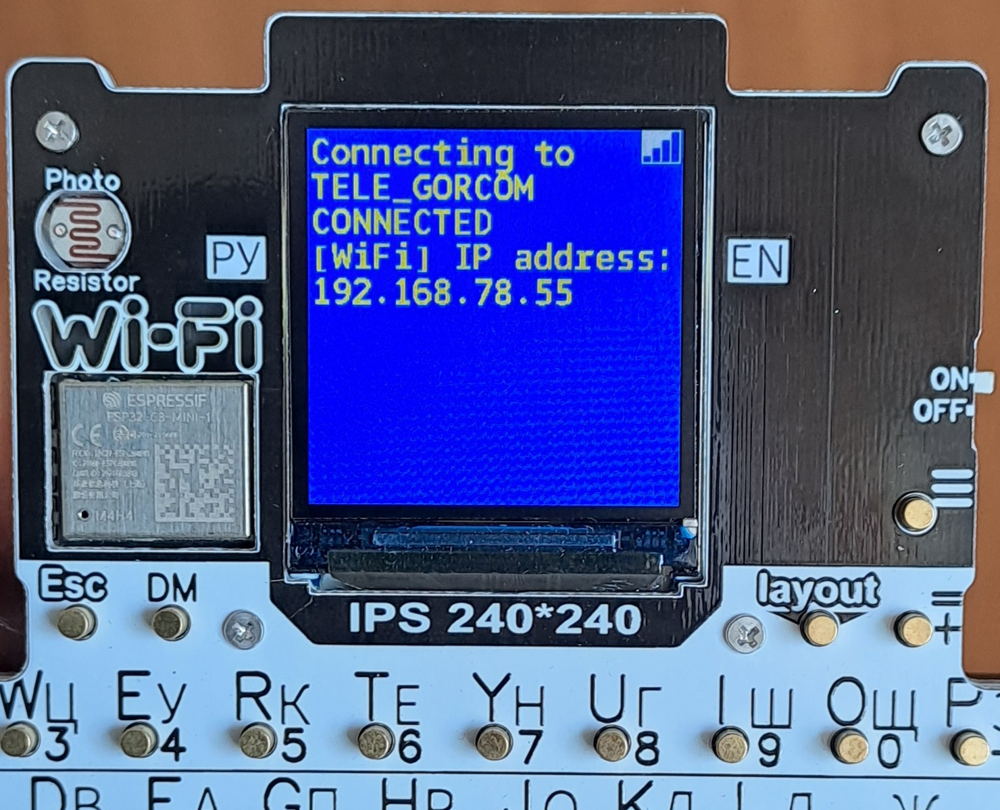

# Терминал управления Умным домом на ESP32


Терминал разработан на микроконтроллере ESP32 C3.
Аппаратно включает в себя:
- клавиатуру;
- дисплей TFT 240x240;
- фоторезистор;
- датчик температуры и влажности SHT30;
- Wi-Fi;
- Bluetooth;
- UART;
- I2C;
- EEPROM.

Программное обеспечение включает в себя Главное меню и следующий набор программ:
- Подключение к Wi-Fi;
- Управление Умным домом;
- Терминал UART для связи с другими устройствами;
- Блокнот для записи заметок;
- График освещенности;
- Погода с сервера openweathermap.org;
- Вольтметр;
- Настройки Терминала.


Для управления умным домом терминал связывается с моим сервером по адресу http://www.gorcom.online 
Передает на сервер команды и запрашивает состояние. Сервер по локальной сети связан с датчиками, роботами и другими устройствами Умного дома.

Примечание: дальность действия Wi-Fi на открытом пространстве 700 метров!


```
# Для автоматческого добавление на GitHub
$ python make.py git "Комментарий"

# Токен GitHub хранится во внешнем файле secret.py в переменной:
# tokenGit = "********"
```

- Написан на языке C++ Arduino

Статус проекта: Разрабатывается.


Copyright (c) 2024 Evgeny Goryachev  
Gor.Com 



